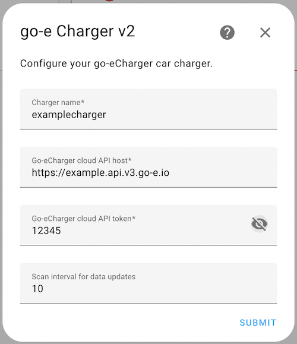

# WIP: Homeassistant integration for go-e Charger Cloud

[](https://github.com/hacs/integration)

This is an integration for the Home Assistant for the go-e Charger Cloud wallbox (API v2) using [this library](https://github.com/openkfw/smart_energy.goecharger-api).

## How to use it

### HACS

1. Open your Home Assistant in a browser.
2. In case you don't have HACS, follow the steps from here <https://hacs.xyz/docs/configuration/basic>.
3. In the left menu you should have HACS icon, click it.
4. Click on `Integrations` -> click 3 dots top right corner -> click `Custom repositories`.
5. In the dialog window, add `https://github.com/openkfw/smart_energy.goecharger` as a repository and select `Integration` as a category.
6. Click `ADD`, wait for spinner to finish and close the dialog.
7. Click `EXPLORE & DOWNLOAD REPOSITORIES` -> search for `go-e` -> select the `go-e Charger Cloud` -> wait and click `DOWNLOAD`.
8. Go to Settings -> System -> click `RESTART` and wait few seconds.
9. Go to Settings -> Devices & Services. Click the `ADD INTEGRATION` button.
10. Search for `go-e Charger Cloud` -> click -> fill in details -> click `SUBMIT`.

Example config:



> Make sure that there is no trailing slash in the API host, otherwise the validation fails. When pressing submit, validation will also check the connectivity and fails if not able to connect and authenticate.

11. Go to the dashboard screen, you should see bunch of sensors for the go-e Charger Cloud integration.

### Example Lovelace card

TBD

## Features

### Sensors

| Parameter | Name                       | Description                                                    |
| --------- | -------------------------- | -------------------------------------------------------------- |
| car       | car_status                 | State of the car - connected/charging/etc.                     |
| alw       | charging_allowed           | Whether the car is allowed to charge at all.                   |
| amp       | charger_max_current        | Requested current for charging in A.                           |
| wh        | energy_since_car_connected | Energy in kWh since car is connected.                          |
| eto       | energy_total               | Total energy used in kWh.                                      |
| psm       | phase_switch_mode          | Phase switch mode - auto/1/3.                                  |
| pnp       | phases_number_connected    | Number of connected phases - relates to the phase_switch_mode. |

### Switches

| Parameter | Name                   | Description              |
| --------- | ---------------------- | ------------------------ |
| frc       | charger_force_charging | Enable/disable charging. |

### Buttons

| Parameter | Name           | Description                                  |
| --------- | -------------- | -------------------------------------------- |
| acs       | access_control | Changes access control to `open` if desired. |

### Number inputs

| Parameter | Name                | Description                                                                            |
| --------- | ------------------- | -------------------------------------------------------------------------------------- |
| amp       | charger_max_current | Set the max current. Min and max values are taken from the `mca` and `ama` parameters. |

### Select inputs

| Parameter | Name              | Description                |
| --------- | ----------------- | -------------------------- |
| psm       | phase_switch_mode | Set the phase switch mode. |

### Exposed services

Following functions are exposed as Home Assistant services, thus can be used by other integrations.

| Name                  | Parameters                                                                                         | Description                                                                                                                                                    |
| --------------------- | -------------------------------------------------------------------------------------------------- | -------------------------------------------------------------------------------------------------------------------------------------------------------------- |
| start_charging        | `{"device_name": "example_charger", "charging_power": 10}` or `{"device_name": "example_charger"}` | Starts charging with a specified charging power. `charging_power` is optional and you can use this service purely to start without setting the charging power. |
| stop_charging         | `{"device_name": "example_charger"}`                                                               | Stop charging.                                                                                                                                                 |
| change_charging_power | `{"device_name": "example_charger", "charging_power": 10}`                                         | Change charging power for a given charger.                                                                                                                     |
| set_phase             | `{"device_name": "example_charger", "phase": 1}`                                                   | Change phase for a given charger. `phase` accepts values 0, 1, 2.                                                                                              |
| set_transaction       | `{"device_name": "example_charger", "status": 0}`                                                  | Set the wallbox transaction. `status` accepts values None (no transaction) and 0 (authenticate all users).                                                     |

### Configuration

The integration can be configured either via UI (config flow) as described in the [How to use it - HACS section](#hacs) or via `configuration.yaml`. For example:

```yaml
smart_energy_goecharger:
  chargers:
    - name: examplecharger
      host: https://example.api.v3.go-e.io
      api_token: 12345
```

## Development

In case you are interested in development, check the guide [here](./docs/dev.md).
